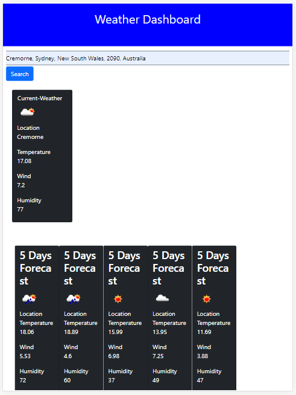

# Weather-Dashboard
In this project we are building a weather dashboard using open weather API.
When the user wants to know the weather for a particular city, they could make a search and will get current temperature, wind and humudity.
User will also get the five days forecast.
Link to deployed app here
https://sgc1992.github.io/Weather-Dashboard/
Link to the GitHub repo is here
https://github.com/sgc1992/Weather-Dashboard
Technologies used
HTML, JavaScript, CSS, Bootstrap andOpen Weather API.

